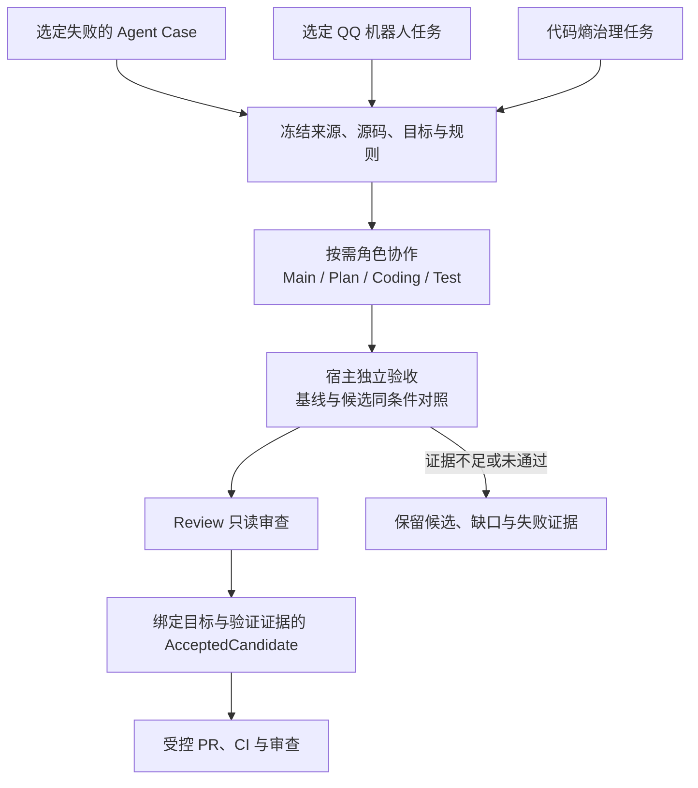

# AgentStrata

**以 Harness 为核心，让自建 Agent 的改进有证据、有验收、有边界。**

AgentStrata 是一个面向自建 Agent 的开源框架，QQ 机器人是当前的落地场景。BotSpec 负责声明模型、工具与上下文；分层运行时负责身份准入、Agent 执行和消息交付；Evaluation 把行为转为可复核的测评证据；Harness 根据选定的问题生成候选，并由独立宿主决定修复是否成立。代码熵治理使用同一套验收和交付机制，让框架本身也能在受控范围内持续演进。

如果你关注 Agent Harness、评测与可验证的自我改进，欢迎给 [AgentStrata 一个 Star](https://github.com/Ling-ye/AgentStrata)。

## Harness：从问题证据到受控改进

Harness 是机器人消息链之外的独立 worker。测评失败、机器人任务和代码熵问题进入同一个修复流程，但保留各自的来源和验收标准：

| 问题来源 | 冻结什么 | 怎样判断改进成立 |
| --- | --- | --- |
| 可修复的测评 Case | 原题、评分、失败实例和执行条件 | 原问题在基线下有效失败；候选通过原目标与保护集 |
| QQ 机器人任务 | 原始观测、人工线索和预期行为分别保存 | 沿 Gateway、Application、Agent 产品链路回放并核对原目标 |
| 代码熵治理 | 远端 main、现行 SDD、黄金原则与选定问题 | 可以从全绿基线开始，但须证明实际改善、行为保持和全仓检查通过 |



这套设计把调查、编程、测试草案、审核和验收分给不同职责。Coding 只写允许的产品文件，Test 只写独立草案；现有测试、评分、权限及正在运行的 Harness 控制程序保持冻结。宿主复用相同的验证定义检查基线与候选，区分产品失败、评分故障、环境故障和证据缺口。只有原目标、保护集和独立审核全部满足，才生成可交付候选。

过程也能复核：每个步骤保留输入、结论和证据引用，命令日志独立查询；轮次、时间和无进展停止条件限制无界返工。修复验收、PR 合并与机器人部署分别记录，交付不会自动部署运行实例。详见 [Harness 设计](https://github.com/Ling-ye/AgentStrata/blob/main/docs/reference/harness.md)、[操作指南](https://github.com/Ling-ye/AgentStrata/blob/main/docs/guides/harness.md)与[交付契约](https://github.com/Ling-ye/AgentStrata/blob/main/docs/reference/delivery.md)。

## 为 Harness 提供证据和持续治理

**Evaluation 提供可比较的问题来源。**项目实现 **IFEval、BFCL、GAIA 等公开 benchmark 的适配、执行与评分流程**，也维护自建 Agent 任务和红队用例。题目条件、执行对象、原生评分、可选语义附评与运行证据分别记录；数据或环境未准备时显示阻断原因，不把未运行题目算进结果。不同测评对象各按自身契约执行，能够进入 Harness 的失败 Case 还需满足修复来源条件。详见 [测评设计](https://github.com/Ling-ye/AgentStrata/blob/main/docs/reference/evaluation.md)。

**代码熵治理让全绿代码也有改进路径。**它从冻结的远端 main 出发，依据现行 SDD 和黄金原则追踪死代码、重复职责、失效配置等问题。发现一个有源码证据的问题，就先完成这一项的修改、全仓检查、行为保持验证和独立审核，再考虑下一项；没有可执行发现或证据不足时保留结论与缺口。

治理范围包括符合写入规则的 Harness 源码。当前任务仍由冻结的宿主和验收规则执行，候选不能改变自己的检查标准；通过验收与交付的 Harness 改动在后续版本生效。详见 [代码熵治理](https://github.com/Ling-ye/AgentStrata/blob/main/docs/reference/code-health.md)。

## 分层运行时：为修复提供真实边界

QQ 消息按 **Channel → Gateway → Application → Agent** 四个职责层处理：平台事件与投递、可信身份与准入、会话和资源准备、模型与工具执行各有归属。BotSpec 声明实例能力，Console 负责控制与观测，Evaluation 和 Harness 在消息链外独立运行。涉及机器人故障时，Harness 验收沿真实产品装配回放目标链路；外部 Provider 和资源可使用冻结夹具，模拟回执不代表真实 QQ 送达。

任务工作台按真实交接顺序显示四层阶段。选中 Agent 阶段后，可在局部执行列表中查看模型与工具调用，并按需读取已采集的模型输入、公开响应、工具执行结果及实际交给模型的内容；Runtime、模型和 Token 信息与任务绑定。未采集或已到期的正文不会由界面补造。详见 [任务观测](https://github.com/Ling-ye/AgentStrata/blob/main/docs/reference/observability.md)。

领域内部另遵循 **Types → Config → Repo → Service → Runtime → UI** 的源码依赖规则；这是现行开发基线，存量代码按涉及范围逐步整理。详见 [架构总览](https://github.com/Ling-ye/AgentStrata/blob/main/docs/reference/architecture.md)。

## 产品界面

以下五张图由当前 Console 前端配合**示例数据**渲染。图中的状态、题目和修复记录用于展示界面，不代表真实部署、模型成绩或线上修复结果；点击图片可查看原图。

**任务运行 · 四层轨迹与 Agent 执行详情**

示例任务同时展示 Channel、Gateway、Application、Agent 四层阶段，以及所选模型调用的输入、工具结果和公开响应。

[](https://github.com/Ling-ye/AgentStrata/blob/main/docs/assets/readme/task-runtime.png)

**Harness · 冻结来源、修复步骤与验收依据**

[](https://github.com/Ling-ye/AgentStrata/blob/main/docs/assets/readme/harness.png)

**代码熵治理 · 问题调查与待判断证据**

[](https://github.com/Ling-ye/AgentStrata/blob/main/docs/assets/readme/code-health.png)

**测评中心 · 题目、执行对象与评分计划**

[](https://github.com/Ling-ye/AgentStrata/blob/main/docs/assets/readme/evaluation.png)

**QQ 机器人实例 · Gateway 运行状态**

[](https://github.com/Ling-ye/AgentStrata/blob/main/docs/assets/readme/bots.png)

## 开始使用

在 Linux 或 WSL2 源码仓中使用 QQ 机器人终端向导：

```bash
git clone https://github.com/Ling-ye/AgentStrata.git
cd AgentStrata
bash deploy/wsl/quickstart.sh
```

向导需要模型 API 配置和 QQ 登录；可先运行 `bash deploy/wsl/quickstart.sh --dry-run` 查看变更。前置条件、人工登录与恢复步骤见 [首次部署](https://github.com/Ling-ye/AgentStrata/blob/main/docs/guides/deployment.md)。

如果要阅读或修改框架源码：

```bash
uv sync --frozen --extra agent --extra acp --extra dev
uv run agentstrata --help
```

开发与检查方式见 [开发指南](https://github.com/Ling-ye/AgentStrata/blob/main/docs/guides/development.md)，各领域入口见 [文档任务地图](https://github.com/Ling-ye/AgentStrata/blob/main/docs/README.md)。Python namespace 仍为 `chatcopilot`，环境变量使用 `CHATCOPILOT_*`；版本与依赖以 [pyproject.toml](https://github.com/Ling-ye/AgentStrata/blob/main/pyproject.toml) 为准。项目提供源码与自托管工具；模型、平台账号和第三方凭据需自行配置。

[贡献](https://github.com/Ling-ye/AgentStrata/blob/main/CONTRIBUTING.md) · [安全](https://github.com/Ling-ye/AgentStrata/blob/main/SECURITY.md) · [支持](https://github.com/Ling-ye/AgentStrata/blob/main/SUPPORT.md) · [行为准则](https://github.com/Ling-ye/AgentStrata/blob/main/CODE_OF_CONDUCT.md) · [变更记录](https://github.com/Ling-ye/AgentStrata/blob/main/CHANGELOG.md) · [MIT 许可](https://github.com/Ling-ye/AgentStrata/blob/main/LICENSE)

## AI 协作者阅读入口

先读 [AGENTS.md](https://github.com/Ling-ye/AgentStrata/blob/main/AGENTS.md) 掌握协作、权限与架构边界；再从 [文档任务地图](https://github.com/Ling-ye/AgentStrata/blob/main/docs/README.md)进入当前任务的领域正文。需要修改架构或公开契约时，沿领域链接继续读对应 [规格](https://github.com/Ling-ye/AgentStrata/blob/main/specs/README.md)和源码；只加载与任务相关的层级，不批量展开全部文档。
