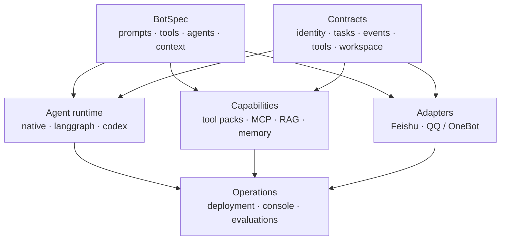

# AgentStrata

**Configure, operate, and evaluate multi-channel AI agents from one declarative runtime.**

[](https://github.com/Ling-ye/AgentStrata/blob/main/LICENSE)
[](https://github.com/Ling-ye/AgentStrata/blob/main/pyproject.toml)
[](https://github.com/Ling-ye/AgentStrata/actions/workflows/ci.yml)

AgentStrata is a self-hosted, single-repository platform for running multiple
AI bot instances. Each `bots/<bot-id>/` directory declares prompts, tools,
agents, context, platform, model routing, workspace, access, and deployment;
the instances share contracts, adapters, middleware, operations, and
evaluations.

> **Status:** alpha source baseline, version `0.1.0.dev0`. The first public
> state is source-only and does not represent a published `v0.1.0` Release.

## Development history

AgentStrata was developed across multiple private repositories from November
2025 through August 2026. The later private repository alone contains 196
commits; the public root records the August 2026 open-source baseline rather
than the beginning of implementation.

See [Project history and architecture evolution](https://github.com/Ling-ye/AgentStrata/blob/main/docs/project-history.md)
for the initial design, problems encountered, architectural changes, and the
resulting system structure.

## Why AgentStrata

- **Declarative instances.** BotSpec keeps behavior and capabilities adjacent
  to the bot that selects them.
- **Backend choice per bot.** Native, LangGraph, and Codex implement common
  task, event, and result contracts.
- **Backend-neutral context observability.** The Console shows the
  AgentStrata-known conversation and each main-agent or subagent turn call's
  effective, redacted context. Binary/private omissions and provider-managed
  state that cannot be inspected are labelled partial or opaque instead of
  being presented as complete.
- **Evidence-labelled task flow.** Bot operations project platform ingress,
  middleware decisions, Agent/model/capability activity, and the strongest
  observed reply boundary into one backend-owned flow. Missing transport
  evidence and hidden provider reasoning remain explicit gaps rather than
  inferred success.
- **Purpose-built runtime boundaries.** Thin web-search providers run in the
  Agent process; browser-backed, account-bound, and shared search-engine
  components remain isolated and are started only when an enabled BotSpec
  requires them.
- **Platform adapters.** QQ / OneBot and Feishu remain outside Agent logic and
  inject identity, files, notifications, and permissions through contracts.
- **Controlled development.** Codex-backed owner sessions dispatch repository
  mutation to isolated code tasks that validate and prepare draft pull
  requests; they do not merge or deploy automatically.
- **Unified evaluation.** The Console exposes a 25-Case direct-Agent catalog
  whose default `full` preset runs the 23 Cases supported by the built-in Bot,
  plus 7 synthetic QQ message-flow Cases; Profile comparisons, BFCL, GAIA, and IFEval
  remain available through the same Evaluation resource and artifact layout.
  Product presets are started manually; BFCL remains a direct-LLM protocol
  calibration. The local service owns managed workers and lifecycle state,
  while the Console is its UI/BFF over a same-user Unix socket.

## Quick start

Requirements: Linux or WSL, Python 3.10–3.13, and Git.

```bash
git clone https://github.com/Ling-ye/AgentStrata.git
cd AgentStrata

python3 -m venv .venv
source .venv/bin/activate
python -m pip install --upgrade pip
python -m pip install -e ".[agent,acp]"

agentstrata --help
agentstrata botspec validate bots/lingye-copilot-qq/bot.yaml
```

The bundled `lingye-copilot-qq` instance demonstrates QQ / NapCat / OneBot,
the Codex backend, private Wiki, memory, MCP, unified search, evaluations, and
isolated code tasks. The bot template can scaffold QQ or Feishu instances;
generic Feishu document, sheet, Bitable, Wiki, messaging, and adapter support
remain public platform capabilities.

Copy the selected bot's `local.env.example` to the ignored `local.env`, replace
the placeholders, and keep the file private:

```bash
cp bots/lingye-copilot-qq/local.env.example bots/lingye-copilot-qq/local.env
chmod 600 bots/lingye-copilot-qq/local.env
python -m chatcopilot bot doctor --bot bots/lingye-copilot-qq/bot.yaml
```

Follow the [deployment guide](https://github.com/Ling-ye/AgentStrata/blob/main/docs/deployment.md)
for first installation and the
[operations runbook](https://github.com/Ling-ye/AgentStrata/blob/main/docs/operations.md)
for routine commands. AgentStrata
does not provide hosted models, chat accounts, or third-party credentials.

## BotSpec in 30 seconds

```yaml
id: my-bot
display_name: My AgentStrata Bot

platform:
  type: feishu
  adapter: feishu_acp

llm:
  chat:
    env_prefix: MY_BOT

prompts:
  schema_version: 2
  identity: prompts/identity.md
  response_style: prompts/response-style.md

tools:
  packs:
    - workspace.read_write
    - memory.chat
    - feishu.document

agents:
  backend: native

context:
  memory_store:
    provider: markdown
    namespace: my-bot
```

Real account IDs, stable user identities, tenant endpoints, document IDs,
repository paths, and credentials belong only in ignored runtime config or the
operator credential store. Public templates contain names and placeholders,
not working values.

Career-intelligence tools start with an empty company watchlist. The user must
specify a company or position. Explicitly requested companies may use a
reviewed public provider; every other target receives a structured web-search
fallback. Snapshots and evidence remain workspace-local, so the provider
catalog does not embed personal targets.

## Architecture



Dependencies flow from contracts toward assembly and operations. Agent code
does not import concrete platforms or BotSpec internals. See
[architecture.md](https://github.com/Ling-ye/AgentStrata/blob/main/docs/architecture.md)
and [runtime.md](https://github.com/Ling-ye/AgentStrata/blob/main/docs/runtime.md).

## Included surfaces

| Area | Support |
| --- | --- |
| Platforms | Feishu; QQ through NapCat / OneBot |
| Agent backends | Native; LangGraph; Codex |
| Models | OpenAI-compatible chat/research APIs; Codex CLI device authentication |
| Capabilities | Local tool packs; in-process web search; reviewed MCP bindings; RAG; memory; private Wiki |
| Operations | React/FastAPI Console BFF; diagnostics; task/context observability; logs |
| Deployment | Linux / WSL; Console and Evaluation systemd user services; desired-state Docker infrastructure |
| Evaluation | Console has two manual tracks: a 25-Case direct-Agent catalog with a 23-Case default `full`, and 7 synthetic QQ message-flow Cases; benchmark/Profile adapters remain available from CLI |

The direct-Agent track bypasses ACP and platform transport. The synthetic QQ
message-flow track starts after a hypothetical QQ event and validates the
AgentStrata-owned ingress, identity, permission, session, persona and response
projection code without external writes. Real QQ/NapCat/OneBot connectivity
remains a platform external check; neither local track counts as real QQ or
external-user end-to-end evidence.

Third-party MCP servers and Skills are not downloaded, installed, or enabled
automatically. Review source, license, command, secret use, and remote write
behavior before adding a binding.

The Evaluation service is part of this repository and release. It does not
bundle an external evaluation engine, experiment tracker, remote evaluator, or
second report store; those integrations require a separate reviewed design.
Console-only restarts leave managed evaluations running. Code updates require
an atomic service-owned maintenance lease: the service proves idle and blocks
new Evaluations for the entire build and restart window, so a new supervisor
never adopts a worker that already loaded an older release. The in-Console
update action requires an independent `systemd-run --user` transient unit;
if that unit cannot be created, it fails before running the update script or
acquiring the maintenance lease.

Image-understanding Cases are configured; image generation is reported as not
configured. SWE-bench Verified, WebArena, and Canary self-update remain planned,
not runnable capabilities. Repository tests do not claim real commercial-LLM,
live-QQ, or Canary end-to-end validation; see the
[operations runbook](https://github.com/Ling-ye/AgentStrata/blob/main/docs/operations.md#evaluation)
for manual commands and evidence boundaries.

## Public-boundary checks

The public scanner covers the index, modified tracked files, untracked
candidates, path names, endpoints, document identifiers, identities, machine
paths, backup artifacts, and credentials without printing matched values or
paths:

Source files and historical blobs keep the full public-boundary policy.
Repository links and contact or sign-off email addresses in commit and tag
messages are treated as normal public collaboration metadata; use
`--strict-git-identities` when bootstrap verification must restrict only the
author, committer, and tagger header emails.

```bash
python scripts/check_public_repo.py
python scripts/check_public_repo.py --history
```

Operators can add organization-specific exact values without committing them:

```bash
chmod 600 /absolute/private/literals.txt
python scripts/check_public_repo.py \
  --private-literals-file /absolute/private/literals.txt
```

The literal file must be outside the repository, owned by the current user,
mode `0600`, a regular non-symbolic single-link file, and valid UTF-8 with one
unique non-empty literal per line. CI uses only public rules; private literal
files and private reports never belong in Git.

## Documentation

| Goal | Guide |
| --- | --- |
| Browse all documentation | [Documentation center](https://github.com/Ling-ye/AgentStrata/blob/main/docs/README.md) |
| Understand project history and architecture evolution | [Project history](https://github.com/Ling-ye/AgentStrata/blob/main/docs/project-history.md) |
| Create and configure a bot | [BotSpec reference](https://github.com/Ling-ye/AgentStrata/blob/main/docs/bot-spec.md) |
| Install on Linux / WSL | [Deployment guide](https://github.com/Ling-ye/AgentStrata/blob/main/docs/deployment.md) |
| Update, restart, inspect, or diagnose | [Operations runbook](https://github.com/Ling-ye/AgentStrata/blob/main/docs/operations.md) |
| Understand boundaries and data flow | [Architecture](https://github.com/Ling-ye/AgentStrata/blob/main/docs/architecture.md) · [Runtime](https://github.com/Ling-ye/AgentStrata/blob/main/docs/runtime.md) |
| Use the Console and Evaluations | [Operations Console](https://github.com/Ling-ye/AgentStrata/blob/main/docs/console.md) |
| Prepare a later signed release | [Release runbook](https://github.com/Ling-ye/AgentStrata/blob/main/docs/releasing.md) |
| Contribute changes | [Contributing guide](https://github.com/Ling-ye/AgentStrata/blob/main/CONTRIBUTING.md) |

## Development

```bash
python -m pip install -e ".[agent,acp,dev]"
.venv/bin/python scripts/check_repo.py fast
```

Run `.venv/bin/python scripts/check_repo.py full` before broad runtime,
packaging, deployment, or Console changes. Architecture, public contracts,
deployment workflows, and migrations use
[SDD-lite](https://github.com/Ling-ye/AgentStrata/blob/main/docs/sdd.md).
The fast profile also audits exact tool-pack membership and checks that Agent,
Console, MCP, subagent, and workflow catalog projections cannot silently drift.
Isolated code-task validation reuses the source checkout's `.venv` and
`console/web/node_modules` as read-only toolchains, so install both Python and
Console development dependencies in the source checkout before starting the
worker. Full validation also receives a read-only candidate Git index containing
the exact task delta; the worker leaves the clone's real index unchanged and does
not pass that candidate index into tests that create their own repositories.
Each quick/full command runs offline in a newly materialized exact candidate tree
with a fresh private home, so clone-local ignored files, shell profiles, and
artifacts from earlier validation attempts cannot enter the next check.

## Compatibility

The public product, distribution, and executable are named `AgentStrata` /
`agentstrata`. The `chatcopilot` Python namespace, `CHATCOPILOT_*` environment
variables, systemd unit names, and existing `~/ChatCopilot*` runtime paths
remain compatibility contracts.

```bash
agentstrata --help
python -m chatcopilot --help
```

## Contributing, security, and license

Read [CONTRIBUTING.md](https://github.com/Ling-ye/AgentStrata/blob/main/CONTRIBUTING.md)
before opening a pull request. Report vulnerabilities through
[SECURITY.md](https://github.com/Ling-ye/AgentStrata/blob/main/SECURITY.md), never
through a public issue containing secrets or private logs. Support boundaries
are in [SUPPORT.md](https://github.com/Ling-ye/AgentStrata/blob/main/SUPPORT.md);
participation is governed by the
[Code of Conduct](https://github.com/Ling-ye/AgentStrata/blob/main/CODE_OF_CONDUCT.md).

AgentStrata is available under the
[MIT License](https://github.com/Ling-ye/AgentStrata/blob/main/LICENSE).
Dependency and redistribution notes are in
[THIRD_PARTY_NOTICES.md](https://github.com/Ling-ye/AgentStrata/blob/main/THIRD_PARTY_NOTICES.md),
and project-name usage is covered by
[TRADEMARKS.md](https://github.com/Ling-ye/AgentStrata/blob/main/TRADEMARKS.md).
