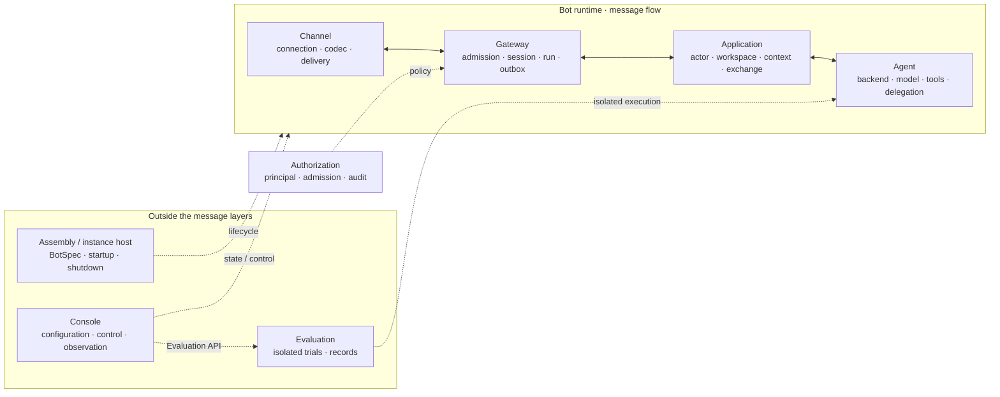

# AgentStrata

**Configure, operate, and evaluate multi-channel AI agents from one declarative runtime.**

[](https://github.com/Ling-ye/AgentStrata/blob/main/LICENSE)
[](https://github.com/Ling-ye/AgentStrata/blob/main/pyproject.toml)
[](https://github.com/Ling-ye/AgentStrata/actions/workflows/ci.yml)

AgentStrata is a self-hosted, single-repository platform for running multiple
AI bot instances. Each `bots/<bot-id>/` directory declares prompts, tools,
agents, context, platform, model routing, workspace, and deployment;
the instances share contracts, adapters, middleware, operations, and
evaluations.

> **Status:** alpha source baseline, version `0.1.0.dev0`. The first public
> state is source-only and does not represent a published `v0.1.0` Release.

运行权限采用 Owner/member 两档：Owner 可使用当前实例资源和已配置项目；成员仅使用公共查询、
当前会话普通文件及记忆读取和追加。三个 Backend 使用相同业务规则，详见
[权限与资源范围](https://github.com/Ling-ye/AgentStrata/blob/main/specs/runtime-permissions-simplification/spec.md)。

## Development history

AgentStrata was developed across multiple private repositories from November
2025 through August 2026. The later private repository alone contains 196
commits; the public root records the August 2026 open-source baseline rather
than the beginning of implementation.

See [Project history and architecture evolution](https://github.com/Ling-ye/AgentStrata/blob/main/docs/project-history.md)
for the initial design, problems encountered, architectural changes, and the
resulting system structure.

## Why AgentStrata

- **Declarative instances.** BotSpec keeps behavior and capabilities adjacent
  to the bot that selects them.
- **Backend choice per bot.** Native, LangGraph, and Codex implement common
  task, event, and result contracts.
- **Backend-neutral context observability.** The Console shows the
  AgentStrata-known conversation and each main-agent or subagent turn call's
  effective, host-visible context. The private operator view shows original
  configuration and recorded values; legacy shared artifacts retain their original
  redaction. Binary omissions and provider-managed
  state that cannot be inspected are labelled partial or opaque instead of
  being presented as complete.
- **Evidence-bound runtime.** The Gateway durably separates admitted ingress,
  authorization decisions, runs, outbox state, and provider receipts. The
  Console shows Channel, Gateway, Application, and Agent handoffs with recorded
  inputs, outputs, and inline call details, alongside configuration snapshots in a runtime
  observation workbench. Runtime-owned recording supports indexed history,
  component metrics, approvals and delivery receipts even while Console is closed;
  detailed bodies expire after 30 days while summaries remain queryable. Legacy ACP task evidence remains separate.
  Missing transport evidence and hidden provider reasoning remain explicit gaps
  rather than inferred success.
- **Purpose-built runtime boundaries.** Thin web-search providers run in the
  Agent process; browser-backed, account-bound, and shared search-engine
  components remain isolated and are started only when an enabled BotSpec
  requires them.
- **Channel boundary.** The Channel owns QQ / OneBot connection, native event
  validation, and delivery. The Gateway controls its lifecycle and owns
  admission, routing, sessions, runs, and delivery evidence. Feishu remains on
  an isolated legacy adapter edge; neither path leaks native platform frames
  into Agent logic.
- **Owner controls in chat.** An Owner verified by Gateway identity and
  admission policies can list the current Bot's slash commands, inspect combined
  session and instance state, and request a state-preserving restart of only
  that Bot after the reply is delivered.
- **Controlled development.** Codex-backed owner sessions dispatch repository
  mutation to isolated code tasks that validate and prepare draft pull
  requests; they do not merge or deploy automatically.
- **Benchmark workbench.** The Console exposes benchmark selection, case previews,
  scoring plans, run evidence and comparable trends through DeepEval. SWE-bench,
  BFCL, GAIA and AgentBench FC have explicit coverage and environment requirements;
  the 63-case project catalog and 7 legacy synthetic QQ cases remain available.
  Native benchmark scores and GEval quality are reported separately. BFCL's current
  adapter measures a subset of direct-model function calling; prepared SWE-bench
  containers use upstream grading, and AgentBench uses its local FC environment.
  The independent Evaluation service owns workers and artifacts; the Console is
  its UI/BFF over a same-user Unix socket. See the [workbench specification](https://github.com/Ling-ye/AgentStrata/blob/main/specs/evaluation-benchmark-workbench/spec.md).


## Quick start

The recommended first deployment is an interactive terminal guide for a
generic QQ assistant. It supports Ubuntu 22.04/24.04/26.04 and Debian
11/12/13 on amd64 or arm64, either as Linux or WSL2 with systemd. Native
Windows is not a deployment target.

```bash
git clone https://github.com/Ling-ye/AgentStrata.git
cd AgentStrata
bash deploy/wsl/quickstart.sh
```

Prepare an OpenAI-compatible API Base URL, model ID, API key, a QQ account for
the bot, and the stable numeric QQ ID of its Owner. The wizard previews system
and Docker changes before asking for confirmation, keeps secrets out of
command-line arguments, and pauses once for you to scan the NapCat QR code in a
local browser. The Console is optional and is not part of this flow.

If WSL systemd or a newly granted Docker group membership requires a restart,
the wizard exits with an exact repair instruction. Continue from actual machine
state instead of starting over:

```bash
bash deploy/wsl/quickstart.sh --resume
```

Successful local checks mean the instance-owned Python Gateway process and the
authenticated loopback boundary to an external NapCat/OneBot provider are
ready. QQ no longer installs or starts Node, cc-connect, or the QQ Relay. The
wizard does not make a paid model call or send a QQ message by default, so a
real user-to-Agent-to-reply roundtrip remains `not_tested` until you send an
ordinary private message or an explicit group @ mention yourself.

See the [first-deployment guide](https://github.com/Ling-ye/AgentStrata/blob/main/docs/deployment.md)
for requirements, permissions and recovery, then use the
[operations runbook](https://github.com/Ling-ye/AgentStrata/blob/main/docs/operations.md)
after installation. AgentStrata does not provide hosted models, chat accounts,
or third-party credentials.

### Developer setup

The guided deployment is not a development environment. Contributors who only
need an editable checkout can install the declared development dependencies and
validate the bundled example without deploying a service:

```bash
uv sync --frozen --extra agent --extra acp --extra dev
uv run agentstrata --help
uv run agentstrata botspec validate bots/lingye-copilot-qq/bot.yaml
```

The bundled `lingye-copilot-qq` instance demonstrates QQ / NapCat / OneBot,
the Codex backend, private Wiki, memory, MCP, unified search, evaluations, and
isolated code tasks. The starter created by the wizard intentionally excludes
those advanced features. The bot template can also scaffold advanced QQ or
Feishu instances.

## BotSpec in 30 seconds

```yaml
id: my-bot
display_name: My AgentStrata Bot

platform:
  type: feishu
  adapter: feishu_acp

llm:
  chat:
    env_prefix: MY_BOT

prompts:
  schema_version: 2
  identity: prompts/identity.md
  response_style: prompts/response-style.md

tools:
  packs:
    - workspace.read_write
    - memory.chat
    - feishu.document

agents:
  backend: native

context:
  memory_store:
    provider: markdown
    namespace: my-bot
```

Real account IDs, stable user identities, tenant endpoints, document IDs,
repository paths, and credentials belong only in ignored runtime config or the
operator credential store. Public templates contain names and placeholders,
not working values.

Career-intelligence tools start with an empty company watchlist. The user must
specify a company or position. Explicitly requested companies may use a
reviewed public provider; every other target receives a structured web-search
fallback. Snapshots and evidence remain workspace-local, so the provider
catalog does not embed personal targets.

## Architecture

Bot messages pass through four responsibility layers: **Channel → Gateway →
Application → Agent**. Execution results return through Application and
Gateway; Channel reports provider acknowledgements to Gateway. Assembly,
Console, and Evaluation sit outside these message-processing layers.



The [four-layer runtime baseline](https://github.com/Ling-ye/AgentStrata/blob/main/specs/runtime-four-layer-definition/spec.md)
is the standing SDD architecture standard. Related runtime designs must follow it;
[SDD-lite](https://github.com/Ling-ye/AgentStrata/blob/main/docs/sdd.md) defines when to reference the baseline
and how existing architecture checks support it.

Solid arrows show message and result flow; dotted arrows show supporting
relationships, not required message stages. Authorization, contracts, model
access, tools, and storage support the four layers. The Channel verifies its
provider connection and structured events; the Gateway uses authorization
policies to decide admission and roles.

The instance host assembles and starts the runtime in the bot process; assembly
does not require another service. Console uses existing configuration, durable
observation, and control interfaces. Evaluation owns an independent lifecycle
and reuses shared Agent assembly for isolated trials. Neither requires every
operation to traverse the message chain. ACP is an authenticated local client
that connects directly to Gateway; Feishu retains its legacy adapter path.

Message arrows are not Python import arrows: Gateway imports the Channel port
and injects its inbound callback, while Channel does not import Gateway. Agent
code does not import concrete Channels, platforms, Gateway, or BotSpec internals. See
[architecture.md](https://github.com/Ling-ye/AgentStrata/blob/main/docs/architecture.md)
and [runtime.md](https://github.com/Ling-ye/AgentStrata/blob/main/docs/runtime.md).

## Included surfaces

| Area | Support |
| --- | --- |
| Platforms | QQ through a Gateway-owned OneBot Channel; Feishu through a legacy adapter edge |
| Agent backends | Native; LangGraph; Codex |
| Models | OpenAI-compatible chat/research APIs; Codex CLI device authentication |
| Capabilities | Local tool packs; in-process web search; reviewed MCP bindings; RAG; memory; private Wiki |
| Operations | React/FastAPI Console BFF; diagnostics; task/context observability; logs |
| Deployment | Linux / WSL; Console and Evaluation systemd user services; desired-state Docker infrastructure |
| Evaluation | DeepEval-backed Agent scoring, readable Case inputs/outputs, and freely grouped progress trends. Console has two manual tracks: a 63-Case engineering regression catalog with a 61-Case default `full`, and 7 legacy synthetic QQ message-flow Cases; benchmark/Profile adapters remain available from CLI |

The direct-Agent track bypasses ACP and platform transport. The existing
synthetic QQ message-flow track exercises the pre-Gateway Relay/attestation/ACP
path and is retained only as a legacy regression suite; it is not evidence for
the new Gateway. Gateway contract and integration tests instead use a fake
loopback OneBot provider, the real Channel/Gateway code, and a deterministic
Agent. Real QQ/NapCat/OneBot connectivity remains a platform external check;
none of these local tracks counts as real QQ or external-user end-to-end
evidence.

Third-party MCP servers and Skills are not downloaded, installed, or enabled
automatically. Review source, license, command, secret use, and remote write
behavior before adding a binding.

The Evaluation service is part of this repository and release. Direct Agent
scoring uses the pinned DeepEval SDK inside isolated Trial processes, with an
independently configured judge model. It does not add an experiment tracker,
remote evaluation scheduler, or second report store.
Console-only restarts leave managed evaluations running. Code updates require
an atomic service-owned maintenance lease: the service proves idle and blocks
new Evaluations for the entire build and restart window, so a new supervisor
never adopts a worker that already loaded an older release. The in-Console
update action requires an independent `systemd-run --user` transient unit;
if that unit cannot be created, it fails before running the update script or
acquiring the maintenance lease.

Image-understanding Cases are configured; image generation is reported as not
configured. SWE-bench Verified, WebArena, and Canary self-update remain planned,
not runnable capabilities. Repository tests do not claim real commercial-LLM,
live-QQ, or Canary end-to-end validation; see the
[operations runbook](https://github.com/Ling-ye/AgentStrata/blob/main/docs/operations.md#evaluation)
for manual commands and evidence boundaries.

## Public-boundary checks

The public scanner covers the index, modified tracked files, untracked
candidates, path names, endpoints, document identifiers, identities, machine
paths, backup artifacts, and credentials without printing matched values or
paths:

Source files and historical blobs keep the full public-boundary policy.
Repository links and contact or sign-off email addresses in commit and tag
messages are treated as normal public collaboration metadata; use
`--strict-git-identities` when bootstrap verification must restrict only the
author, committer, and tagger header emails.

```bash
python scripts/check_public_repo.py
python scripts/check_public_repo.py --history
```

Operators can add organization-specific exact values without committing them:

```bash
chmod 600 /absolute/private/literals.txt
python scripts/check_public_repo.py \
  --private-literals-file /absolute/private/literals.txt
```

The literal file must be outside the repository, owned by the current user,
mode `0600`, a regular non-symbolic single-link file, and valid UTF-8 with one
unique non-empty literal per line. CI uses only public rules; private literal
files and private reports never belong in Git.

## Documentation

| Goal | Guide |
| --- | --- |
| Browse all documentation | [Documentation center](https://github.com/Ling-ye/AgentStrata/blob/main/docs/README.md) |
| Understand project history and architecture evolution | [Project history](https://github.com/Ling-ye/AgentStrata/blob/main/docs/project-history.md) |
| Create and configure a bot | [BotSpec reference](https://github.com/Ling-ye/AgentStrata/blob/main/docs/bot-spec.md) |
| Install on Linux / WSL | [Deployment guide](https://github.com/Ling-ye/AgentStrata/blob/main/docs/deployment.md) |
| Update, restart, inspect, or diagnose | [Operations runbook](https://github.com/Ling-ye/AgentStrata/blob/main/docs/operations.md) |
| Understand boundaries and data flow | [Architecture](https://github.com/Ling-ye/AgentStrata/blob/main/docs/architecture.md) · [Runtime](https://github.com/Ling-ye/AgentStrata/blob/main/docs/runtime.md) |
| Use the Console and Evaluations | [Operations Console](https://github.com/Ling-ye/AgentStrata/blob/main/docs/console.md) |

Agent 能力测评使用 DeepEval，按测评集与 Case 浏览；新业务题使用严格 LLM 判定，63 个既有工程回归题保留程序断言，公开基准保留原生评分。文件维护方法见 [业务 Case 指南](https://github.com/Ling-ye/AgentStrata/blob/main/docs/evaluation-business-cases.md)；用例范围与使用方式见 [Console 文档](https://github.com/Ling-ye/AgentStrata/blob/main/docs/console.md)。
| Prepare a later signed release | [Release runbook](https://github.com/Ling-ye/AgentStrata/blob/main/docs/releasing.md) |
| Contribute changes | [Contributing guide](https://github.com/Ling-ye/AgentStrata/blob/main/CONTRIBUTING.md) |

## Development

```bash
python -m pip install -e ".[agent,acp,dev,evaluation]"
.venv/bin/python scripts/check_repo.py fast
```

Run `.venv/bin/python scripts/check_repo.py full` before broad runtime,
packaging, deployment, or Console changes. Architecture, public contracts,
deployment workflows, and migrations use
[SDD-lite](https://github.com/Ling-ye/AgentStrata/blob/main/docs/sdd.md).
The fast profile also audits exact tool-pack membership and checks that Agent,
Console, MCP, subagent, and workflow catalog projections cannot silently drift.
Isolated code-task validation reuses the source checkout's `.venv` and
`console/web/node_modules` as read-only toolchains, so install both Python and
Console development dependencies in the source checkout before starting the
worker. Full validation also receives a read-only candidate Git index containing
the exact task delta; the worker leaves the clone's real index unchanged and does
not pass that candidate index into tests that create their own repositories.
Each quick/full command runs offline in a newly materialized exact candidate tree
with a fresh private home, so clone-local ignored files, shell profiles, and
artifacts from earlier validation attempts cannot enter the next check.

## Compatibility

The public product, distribution, and executable are named `AgentStrata` /
`agentstrata`. The `chatcopilot` Python namespace, `CHATCOPILOT_*` environment
variables, systemd unit names, and existing `~/ChatCopilot*` runtime paths
remain compatibility contracts.

Unused Python forwarding imports were removed in L01. External scripts must use
the current Core, Contracts and component-catalog modules; see the
[retired import mapping](https://github.com/Ling-ye/AgentStrata/blob/main/specs/legacy-l01-import-removal/spec.md).
This does not change bot configuration or migrate existing runtime data.

```bash
agentstrata --help
python -m chatcopilot --help
```

## Contributing, security, and license

Read [CONTRIBUTING.md](https://github.com/Ling-ye/AgentStrata/blob/main/CONTRIBUTING.md)
before opening a pull request. Report vulnerabilities through
[SECURITY.md](https://github.com/Ling-ye/AgentStrata/blob/main/SECURITY.md), never
through a public issue containing secrets or private logs. Support boundaries
are in [SUPPORT.md](https://github.com/Ling-ye/AgentStrata/blob/main/SUPPORT.md);
participation is governed by the
[Code of Conduct](https://github.com/Ling-ye/AgentStrata/blob/main/CODE_OF_CONDUCT.md).

AgentStrata is available under the
[MIT License](https://github.com/Ling-ye/AgentStrata/blob/main/LICENSE).
Dependency and redistribution notes are in
[THIRD_PARTY_NOTICES.md](https://github.com/Ling-ye/AgentStrata/blob/main/THIRD_PARTY_NOTICES.md),
and project-name usage is covered by
[TRADEMARKS.md](https://github.com/Ling-ye/AgentStrata/blob/main/TRADEMARKS.md).
