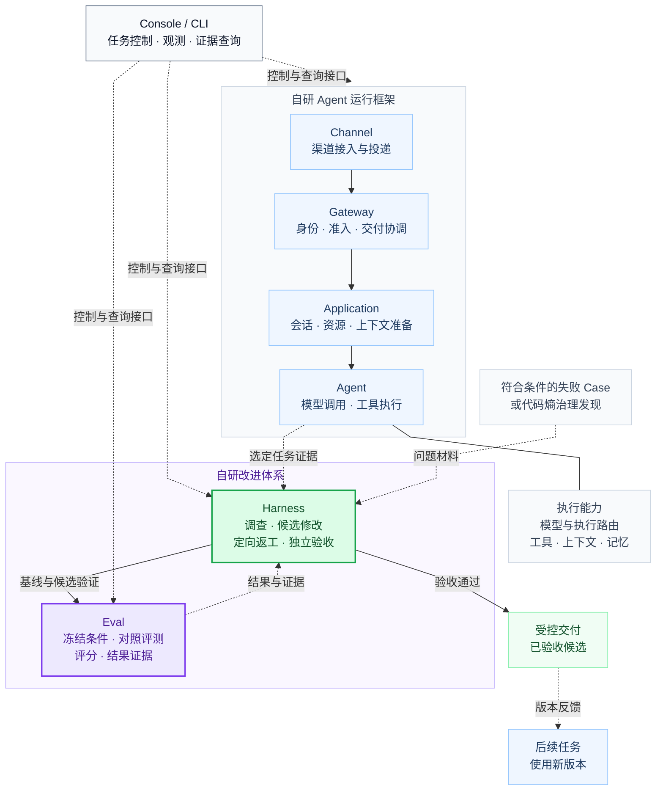
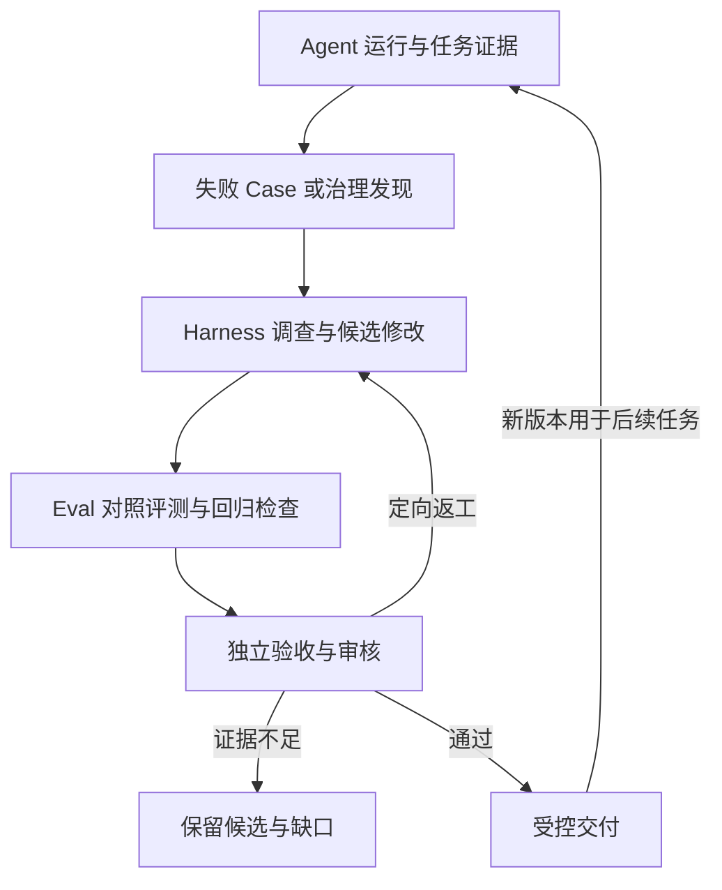

<div align="center">

# AgentStrata

### 具备自我优化能力的开源 Agent 框架

**以自研 Harness 和 Eval 为核心，让 Agent 的改进可复现、可验证、可追溯。**

构建与运行 Agent → 发现问题 → 生成改进 → 对照评测 → 独立验收 → 后续任务使用新版本

[](https://github.com/Ling-ye/AgentStrata/blob/main/LICENSE)
[](https://github.com/Ling-ye/AgentStrata/blob/main/pyproject.toml)
[](https://github.com/Ling-ye/AgentStrata/blob/main/docs/guides/deployment.md)

[框架总览](#框架总览) · [自我优化](#如何实现自我优化) · [Harness](#harness自研修复与验收体系) · [Eval](#eval自研评测与证据体系) · [快速开始](#快速开始) · [产品界面](#产品界面) · [文档](https://github.com/Ling-ye/AgentStrata/blob/main/docs/README.md)

</div>

AgentStrata 面向希望构建、运行和持续改进 Agent 的开发者。项目自行定义运行架构、身份与权限、上下文和工具契约，并通过自研 **Harness 修复与验收体系**、**Eval 评测与证据体系**，将问题调查、候选修改和改动效果判断连接起来。

开发者既可以运行 Agent 应用，也可以用失败 Case 或任务观测驱动修复，或启动代码熵治理，改进框架自身的实现。Console 提供任务控制、对照结果与证据查看；QQ 机器人是当前应用入口之一。

## 框架总览


```mermaid
---
config:
  flowchart:
    curve: linear
    nodeSpacing: 20
    rankSpacing: 34
    subGraphTitleMargin:
      top: 8
      bottom: 14
---
flowchart TB
    UI["Console / CLI<br/>任务控制 · 观测 · 证据查询"]:::control

    subgraph RUN["自研 Agent 运行框架"]
        direction LR
        CH["Channel<br/>渠道接入与投递"]:::runtime
        GW["Gateway<br/>身份 · 准入 · 交付协调"]:::runtime
        APP["Application<br/>会话 · 资源 · 上下文准备"]:::runtime
        AG["Agent<br/>模型调用 · 工具执行"]:::runtime
        CH --> GW --> APP --> AG
    end

    CAP["执行能力<br/>模型与执行路由<br/>工具 · 上下文 · 记忆"]:::support

    SOURCE["符合条件的失败 Case<br/>或代码熵治理发现"]:::support

    subgraph IMPROVE["自研改进体系"]
        direction LR
        H["Harness<br/>调查 · 候选修改<br/>定向返工 · 独立验收"]:::harness
        E["Eval<br/>冻结条件 · 对照评测<br/>评分 · 结果证据"]:::eval
        H -->|基线与候选验证| E
        E -. 结果与证据 .-> H
    end

    D["受控交付<br/>已验收候选"]:::delivery
    NEXT["后续任务<br/>使用新版本"]:::runtime

    UI -. 控制与查询接口 .-> RUN
    UI -. 控制与查询接口 .-> H
    UI -. 控制与查询接口 .-> E
    AG --- CAP
    AG -. 选定任务证据 .-> H
    SOURCE -. 问题材料 .-> H
    H -->|验收通过| D
    D -. 版本反馈 .-> NEXT

    style RUN fill:#f8fafc,stroke:#cbd5e1,color:#334155
    style IMPROVE fill:#faf7ff,stroke:#c4b5fd,color:#4c1d95
    classDef control fill:#f8fafc,stroke:#64748b,color:#0f172a
    classDef runtime fill:#eff6ff,stroke:#93c5fd,color:#1e3a5f
    classDef support fill:#f8fafc,stroke:#cbd5e1,color:#334155
    classDef harness fill:#dcfce7,stroke:#16a34a,stroke-width:2px,color:#14532d
    classDef eval fill:#ede9fe,stroke:#7c3aed,stroke-width:2px,color:#4c1d95
    classDef delivery fill:#f0fdf4,stroke:#86efac,color:#14532d
```

四层运行链负责处理消息，Harness 与 Eval 在链外协作。虚线表示控制、证据或版本反馈关系，无箭头实线表示执行能力通过公共契约接入。已验收的改动经受控交付供后续任务使用，当前宿主与验收规则保持冻结。

## 如何实现自我优化

AgentStrata 的自我优化发生在代码、获准提示词、工具实现、执行流程及受限的 Skill 经验层面。每次改进先形成候选，再由冻结的验证条件与独立审核判断是否接受。


```mermaid
flowchart TB
    R[Agent 运行与任务证据] --> P[失败 Case 或治理发现]
    P --> H[Harness 调查与候选修改]
    H --> E[Eval 对照评测与回归检查]
    E --> A[独立验收与审核]
    A -- 定向返工 --> H
    A -- 证据不足 --> G[保留候选与缺口]
    A -- 通过 --> D[受控交付]
    D -- 新版本用于后续任务 --> R
```

| 改进方式 | 如何开始 | 如何判断有效 |
| --- | --- | --- |
| 故障自修复 | 选择符合条件的失败 Case 或机器人任务 | 确认失败基线，验证原目标改善，并保护已有通过项 |
| 自身代码治理 | 按现行设计与黄金原则调查代码熵，可包含 Harness 自身 | 证明实际改善与行为保持，通过仓库检查及独立审核 |
| 经验沉淀 | Harness 相关治理项合入后，判断是否存在可复用方法 | 受限 Skill 学习任务经审核交付，由后续任务读取新版本 |

操作者选择任务来源与预算，也可显式启用定时代码熵治理。当前任务始终使用冻结宿主、规则与评分；候选不能改变本次验收标准。新版本在后续任务生效，机器人实例更新仍按部署流程进行。这里的优化不涉及模型权重训练，执行状态、环境或证据无法确认时保留缺口。

## Harness：自研修复与验收体系

Harness 负责决定调查、计划、编码、测试、返工、审核和接受的顺序。项目自行实现来源冻结、角色权限、候选工作区、失败分类、预算、操作回执与验收规则，具体编排和执行实现通过清晰的职责边界协作。

- **有依据地改。** 从失败运行、人工线索或治理发现形成明确目标，在隔离工作区生成候选。
- **编码与验收分权。** Coding 只写获准产品文件，Test 只写验证草案，Review 独立审查；既有测试、评分与当前宿主保持冻结。
- **按具体失败返工。** 产品、测试、评分、环境和材料问题分别记录，明确错误返回相关角色，预算和无进展规则约束循环。
- **精确绑定结果。** 只有目标、保护集、仓库回归和所需独立确认满足要求，才签发绑定候选与证据的验收回执。
- **可恢复、可追查。** 图检查点与外部操作回执分别核对，已有确认结果可复用，执行终态未知时先对账；角色产物和命令日志按需查看。

修复验收、PR 交付和部署分别记录。完整机制见 [Harness 契约](https://github.com/Ling-ye/AgentStrata/blob/main/docs/reference/harness.md)，操作见 [Harness 指南](https://github.com/Ling-ye/AgentStrata/blob/main/docs/guides/harness.md)。

## Eval：自研评测与证据体系

Eval 为改动提供独立的判断依据。项目自行组织 Case、Target、Trial、隔离执行、服务生命周期、结果持久化与可比条件；具体评分遵循各基准的原生规则和题目声明的指标。

| 能力 | 对开发者的价值 |
| --- | --- |
| 冻结题目、执行对象、评分与环境条件 | 对照基线和候选，区分改善、已有失败和新增回归 |
| 保存回答、工具轨迹、真实产物与逐项评分 | 判断失败发生在哪一步，为修复和瓶颈分析提供依据 |
| 独立保存原生评分与附加语义评分 | 保留原目标，避免附评分数覆盖基准成绩 |
| 核对题集、模型、评分与环境的可比性 | 避免把执行条件变化直接解释为能力进步 |

项目实现 **IFEval、BFCL、GAIA 等公开 benchmark 的适配、执行与评分流程**，同时维护自建 Agent 任务与红队用例。环境或数据未准备时显示阻断原因。符合来源条件的失败实例可以进入 Harness，原题与评分继续由 Eval 管理。

详见 [Evaluation 机制](https://github.com/Ling-ye/AgentStrata/blob/main/docs/reference/evaluation.md)、[评测指南](https://github.com/Ling-ye/AgentStrata/blob/main/docs/guides/evaluation.md)与[用例指南](https://github.com/Ling-ye/AgentStrata/blob/main/docs/guides/evaluation-cases.md)。

## 项目模块与执行路由

消息运行遵循项目定义的 **Channel → Gateway → Application → Agent** 四层架构。身份、准入、资源、会话、模型、工具与用户交付各有职责；Harness、Eval 和 Console 位于消息运行链之外。

| 项目模块 | 负责什么 |
| --- | --- |
| 自研运行框架 | 四层职责、身份权限、会话、实例配置、执行结果与交付事实 |
| 模型与执行路由 | 按配置选择执行方式与模型，共享项目定义的任务、工具、权限和结果契约 |
| 工具、上下文与记忆 | 在获准范围内提供能力、准备材料并保存上下文 |
| 自研 Harness | 修复策略、角色协作、候选隔离、恢复回执、独立验收及治理流程 |
| 自研 Eval | 评测对象、任务执行、条件绑定、评分组织、证据、比较与服务生命周期 |
| Console / CLI | 任务控制、观测、候选与证据查看，以及交付状态查询 |

框架的执行方式与模型通过路由配置选择，各入口的支持范围以对应契约为准。具体路由见 [Agent 与执行 Runtime](https://github.com/Ling-ye/AgentStrata/blob/main/docs/reference/agent.md)，设计参考、当前实现依赖和源码入口见[架构总览](https://github.com/Ling-ye/AgentStrata/blob/main/docs/reference/architecture.md)。

## 快速开始

### 给人类：选择你的使用路径

在 Linux 或 WSL2 准备源码开发环境：

```bash
git clone https://github.com/Ling-ye/AgentStrata.git
cd AgentStrata
uv sync --frozen --extra agent --extra acp --extra dev --extra weixin
uv run agentstrata --help
```

| 想做什么 | 从哪里开始 |
| --- | --- |
| 测量 Agent 表现、比较改动 | 按 [Evaluation 指南](https://github.com/Ling-ye/AgentStrata/blob/main/docs/guides/evaluation.md)准备模型、数据与评测环境 |
| 修复失败或改进框架自身 | 按 [Harness 指南](https://github.com/Ling-ye/AgentStrata/blob/main/docs/guides/harness.md)配置专用 worker、评测服务和交付，再选择失败来源或代码熵任务 |
| 运行 QQ 机器人应用 | 按[首次部署](https://github.com/Ling-ye/AgentStrata/blob/main/docs/guides/deployment.md)使用 `bash deploy/wsl/quickstart.sh`，可先加 `--dry-run` 预览 |
| 修改代码与扩展能力 | 从[开发指南](https://github.com/Ling-ye/AgentStrata/blob/main/docs/guides/development.md)进入对应领域和检查范围 |

正式 Harness 入口冻结远端 main，通过验收后由宿主创建正式 PR 并启用 squash 自动合并；开始前须配置相应交付权限。模型、平台账号与第三方服务由使用者配置。上述命令准备源码环境，各运行组件的配置按对应指南完成。

### 给 AI：按任务逐层读取

可以将以下说明交给仓库中的 AI 协作者：

> 先读取根目录 AGENTS.md，确认 AgentStrata 的定位、协作边界与任务路由。根据我的当前目标读取相关领域章节，沿源码入口核对实现与测试；涉及架构、公共契约、部署或迁移时再展开对应规格。说明依据、改动与实际验证。

[AGENTS.md](https://github.com/Ling-ye/AgentStrata/blob/main/AGENTS.md)是 AI 协作入口，[文档导航](https://github.com/Ling-ye/AgentStrata/blob/main/docs/README.md)面向使用与开发任务。两条路径共用领域正文，完整规则只维护一处。

## 产品界面

以下截图由当前 Console 前端配合**示例数据**渲染，展示界面布局与信息组织，不代表真实部署、模型成绩或线上修复结果；点击图片可查看原图。

**Harness：冻结来源、修复步骤与验收依据**

[](https://github.com/Ling-ye/AgentStrata/blob/main/docs/assets/readme/harness.png)

**Evaluation：题目、执行对象与评分计划**

[](https://github.com/Ling-ye/AgentStrata/blob/main/docs/assets/readme/evaluation.png)

<details>
<summary>查看任务轨迹、代码熵治理与机器人实例</summary>

**任务运行：四层轨迹、模型输入与工具结果**

[](https://github.com/Ling-ye/AgentStrata/blob/main/docs/assets/readme/task-runtime.png)

**代码熵治理：问题调查与待判断证据**

[](https://github.com/Ling-ye/AgentStrata/blob/main/docs/assets/readme/code-health.png)

**QQ 机器人实例：Gateway 运行状态**

[](https://github.com/Ling-ye/AgentStrata/blob/main/docs/assets/readme/bots.png)

</details>

## 开源价值与相关项目

AGPL-3.0-only 许可开放项目的运行实现、自研 Harness、Eval、修复规则与验收源码。开发者可以自行运行、审查和修改这套改进过程；模型、计算资源与第三方服务仍需自行配置。

| 项目 | 主要职责 | 与 AgentStrata 的关系 |
| --- | --- | --- |
| LangSmith / Engine | 观测、评测、问题调查与修复工作流 | [SDK 为 MIT 开源](https://github.com/langchain-ai/langsmith-sdk/blob/main/LICENSE)；Engine 商业自托管需要相应许可，见[官方说明](https://docs.langchain.com/langsmith/engine-self-hosted) |
| AgentStrata | Agent 运行、自研 Harness 与 Eval、框架自身的受控改进 | [AGPL-3.0-only 开源](https://github.com/Ling-ye/AgentStrata/blob/main/LICENSE)，修复、评测与验收实现可自行运行、审查和修改 |

授权与产品边界于 2026-10-19 核对。此表说明职责与开放方式，不代表性能或修复成功率排名。

各执行入口的前置条件与支持范围见 [Agent 路由说明](https://github.com/Ling-ye/AgentStrata/blob/main/docs/reference/agent.md)和 [Harness 操作指南](https://github.com/Ling-ye/AgentStrata/blob/main/docs/guides/harness.md)。通用外部项目接入、自训练本地模型执行完整修复链及模型自动调参搜索尚未提供；阶段记录能帮助定位瓶颈，自动性能诊断仍需额外实现。产品回放可使用冻结外部夹具，模拟回执不证明真实 QQ 送达。

## 参与开发

欢迎改进 Harness 的失败调查与验收、Eval 的用例和证据，也欢迎扩展运行、工具、上下文和 Console。先从[贡献指南](https://github.com/Ling-ye/AgentStrata/blob/main/CONTRIBUTING.md)与[文档导航](https://github.com/Ling-ye/AgentStrata/blob/main/docs/README.md)进入对应领域。Python namespace 仍为 `chatcopilot`，依赖与支持范围以 [pyproject.toml](https://github.com/Ling-ye/AgentStrata/blob/main/pyproject.toml) 为准。

[安全](https://github.com/Ling-ye/AgentStrata/blob/main/SECURITY.md) · [支持](https://github.com/Ling-ye/AgentStrata/blob/main/SUPPORT.md) · [行为准则](https://github.com/Ling-ye/AgentStrata/blob/main/CODE_OF_CONDUCT.md) · [变更记录](https://github.com/Ling-ye/AgentStrata/blob/main/CHANGELOG.md) · [AGPL-3.0-only 许可](https://github.com/Ling-ye/AgentStrata/blob/main/LICENSE)

## 版权、许可与源码

Copyright (C) 2026 Lingye · 联系：616202172@qq.com。项目自有代码和文档采用
[AGPL-3.0-only](https://github.com/Ling-ye/AgentStrata/blob/main/LICENSE)，完整适用范围见 [COPYRIGHT](https://github.com/Ling-ye/AgentStrata/blob/main/COPYRIGHT)。允许依许可商业使用、
修改和再分发；本程序不提供担保。第三方材料按[第三方声明](https://github.com/Ling-ye/AgentStrata/blob/main/THIRD_PARTY_NOTICES.md)保留原许可。
历史版本已授予的 MIT 权利不受本次迁移影响。

[项目源码](https://github.com/Ling-ye/AgentStrata)可公开获取；Console「许可与源码」、
`agentstrata source` 和机器人 `/source` 提供同一入口。部署修改版时，运营者须将
`CHATCOPILOT_SOURCE_URL` 设置为实际运行版本的完整源码获取地址，不能只指向上游最新分支。
源码交付要求与选配集成边界见[公开与发布契约](https://github.com/Ling-ye/AgentStrata/blob/main/docs/reference/publication.md#许可与对应源码)。
