# 项目沿革与架构演进

AgentStrata 的开发始于 2025 年 11 月，先后经历早期原型仓库和后期私有开发仓库，
并于 2026 年 8 月建立公开基线。后期私有仓库包含 196 次提交；更早仓库未计入
这个数字。

公开仓库从审计后的源码树建立，因此公开根提交只表示开源基线，不表示项目起点。
具体规则见
[`fresh-public-repository-bootstrap`](../specs/fresh-public-repository-bootstrap/spec.md)。
下文集中说明项目最初如何组织、实践中暴露了什么问题，以及架构如何逐步调整。

## 演进总览

```mermaid
flowchart LR
    A["端到端原型<br/>打通消息、Agent、工具与部署"]
    B["声明式实例<br/>BotSpec · adapters · tool packs"]
    C["契约内核<br/>contracts · core · architecture gates"]
    D["统一 Agent runtime<br/>Native · LangGraph · Codex"]
    E["隔离开发任务<br/>read-only session · worker · Draft PR"]
    F["统一搜索<br/>direct providers · deadlines · circuits"]
    G["统一 Evaluation<br/>lifecycle · claims · artifacts"]
    H["公开基线<br/>public boundary · capability parity"]
    I["插件化能力评测<br/>trusted cases · supervised trials"]
    J["确认式开发请求<br/>plan first · explicit confirm · isolated evidence"]
    K["QQ 群级共享会话<br/>conversation scope · turn identity · actor-bound execution"]

    A --> B --> C --> D --> E --> F --> G --> H --> I --> J --> K
```

这些阶段按主要架构变化划分，实际开发时间存在重叠。

## 1. 端到端原型：先打通完整运行链路

**初始设计**

项目最初以可运行的机器人为目标，在同一工程中串联平台消息、LLM turn、工具调用、
workspace、部署和基础运维。这个阶段优先验证端到端能力，而不是提前拆分大量抽象层。

**暴露的问题**

随着平台、工具和运行场景增加，实例策略、平台行为、Agent 逻辑和部署参数开始互相
影响。继续在共享 runtime 中增加机器人或平台条件，会让每次扩展都触及多层代码。

**优化**

保留单一代码库，但把实例差异从共享实现中提取出来：机器人负责声明自身能力，
共享层负责稳定运行机制，平台差异通过 adapter 接入。

**结果**

项目从“一个可运行的机器人实现”转向“多个机器人实例共享同一运行平台”。

相关文档：[`README.md`](../README.md)、
[`architecture.md`](architecture.md)。

## 2. 声明式实例：用 BotSpec 取代产品分支

**初始设计**

早期配置与实现仍然紧密相邻。机器人需要什么 prompt、工具、模型、上下文或平台能力，
部分由配置表达，部分由代码路径决定。

**暴露的问题**

新增机器人或平台时，如果继续在 Agent、middleware 和部署脚本中加入条件分支，
实例差异就会扩散到共享层；工具发现、权限和运行配置也容易形成多套事实源。

**优化**

BotSpec 被整理为四个核心面：

- `prompts`：角色与行为指令。
- `tools`：工具包、MCP binding 和能力开关。
- `agents`：主 backend、subagent、搜索策略和访问模式。
- `context`：RAG、Wiki、memory、playbooks、代码仓库和开发范围。

`platform`、`llm`、`workspace`、`deploy` 和 `access` 组成实例运行包络。
平台通过 registry 自动发现 adapter，工具通过 catalog 和 tool pack 装配。

**结果**

实例能力可以通过 BotSpec 组合；新增平台主要实现 adapter，新增工具能力主要进入
tool pack 或 MCP catalog，而不是修改 Agent 层的产品分支。

相关文档：[`bot-spec.md`](bot-spec.md)、
[`architecture.md#BotSpec 组合`](architecture.md#botspec-组合)。

## 3. 契约内核：从便利 import 转向可检查的依赖方向

**初始设计**

平台、middleware、Agent、BotSpec 和 external tools 已经形成模块分区，但部分共享
DTO、registry 和策略仍定义在具体实现包中。Prompt assembly、workspace 类型和组件
发现也存在跨层直接引用。

**暴露的问题**

便利 import 逐渐形成反向依赖：

- Contracts 之外的实现包拥有跨层 DTO。
- External tools 依赖 Agent 或 BotSpec 内部结构。
- Console 直接读取内部 registry。
- Search 新旧实现互相引用，兼容入口和实际实现边界不清。
- 大型 facade 持续吸收新职责。

这些依赖让局部修改更容易越过层级边界，也允许相似行为在不同位置并行演化。

**优化**

项目引入 `chatcopilot.contracts` 作为共享类型内核，并进一步建立：

- `chatcopilot.core`：配置、LLM client、MCP catalog、workspace runtime 等中立入口。
- `chatcopilot.component_catalog`：控制面读取组件信息的稳定投影。
- Canonical imports 与只负责旧导出的 compatibility wrappers。
- 稳定 facade 与同层聚焦子模块的拆分规则。
- `scripts/check_architecture.py` 和 SDD-lite 规格门禁。

**结果**

依赖方向由约定变成可执行检查。Agent、external tools、contracts、platforms 和
control plane 的职责边界能够在 CI 与本地验证中持续约束。

相关规格：
[`architecture-contract-kernel`](../specs/architecture-contract-kernel/spec.md)、
[`architecture-boundary-consolidation`](../specs/architecture-boundary-consolidation/spec.md)、
[`architecture-decoupling-roadmap`](../specs/architecture-decoupling-roadmap/spec.md)。

## 4. 主 Agent 收敛：统一 Native、LangGraph 与 Codex 生命周期

**初始设计**

Native 和 LangGraph 已经可以作为主 Agent，Codex 随后加入。不同 backend 对
session、streaming、工具结果和 turn completion 的职责划分并不一致，ACP 还承担了
部分 backend 特有的路由和生命周期逻辑。

**暴露的问题**

Backend 差异向上泄漏后，同一条消息在附件、权限、session 恢复、错误处理和事件流
方面可能经过不同路径；新增 backend 也容易复制一套 turn orchestration。

**优化**

三个 backend 统一到 `AgentTask`、`AgentEvent`、`AgentResult` 和共享 turn
runtime：

- `BotSpec.agents.backend` 成为主 backend 的唯一选择点。
- Backend 按整个实例选择，不按角色、命令或单回合动态切换。
- ACP 只保存不透明的 backend session reference。
- 附件、访问检查、确定性回复、session materialization、执行和完成事件进入有序
  pipeline。
- Backend 能力与工具访问策略取交集，不支持的能力明确失败。

**结果**

Native、LangGraph 和 Codex 成为相同生命周期契约后的平级实现；平台层和控制面不再
需要理解某个 backend 的内部 session 模型。

相关规格：
[`main-agent-backend-unification`](../specs/main-agent-backend-unification/spec.md)、
[`deterministic-llm-boundaries`](../specs/deterministic-llm-boundaries/spec.md)、
[`lazy-acp-agent-runtime`](../specs/lazy-acp-agent-runtime/spec.md)。

## 5. 开发能力隔离：从交互式修改转向异步代码任务

**初始设计**

Owner 会话可以发起源码修改，早期流程更接近同步执行：对话、代码变更、验证和运行
环境之间的边界较弱。

**暴露的问题**

如果交互会话同时拥有源码写入、个人凭据、宿主 shell 和发布能力，就难以稳定保证：

- 一次任务只修改声明范围。
- 取消、恢复和失败不会留下不明状态。
- Worker 无法读取个人 MCP、平台凭据或宿主源码。
- 验证通过的 commit 与交付的 Pull Request 完全一致。
- 源码修改不会自动变成部署或服务重启。

**优化**

开发流程改为双 lane：

- 主 Codex 会话保持源码只读，只负责提交和查询任务。
- 独立 code worker 从远端默认分支创建任务专属 clone。
- Worker 在隔离边界中运行，使用独立认证 lane 和资源限制。
- `context.dev` 约束允许与禁止修改的路径。
- 受信宿主在验证后提交任务分支并创建 Draft Pull Request。
- 流程不自动 merge、deploy、restart，也不覆盖操作者工作区。

**结果**

对话能力与源码 mutation、验证、交付和部署被拆成不同信任边界；Native/LangGraph
原有的本地 RepositoryTaskService 仍作为独立能力保留。

相关规格：
[`codex-main-session-permissions`](../specs/codex-main-session-permissions/spec.md)、
[`qq-owner-isolated-code-tasks`](../specs/qq-owner-isolated-code-tasks/spec.md)、
[`codex-independent-auth-lanes`](../specs/codex-independent-auth-lanes/spec.md)、
[`codex-pull-request-delivery`](../specs/codex-pull-request-delivery/spec.md)。

## 6. 搜索收敛：从按来源编排转向统一执行

**初始设计**

不同搜索源主要通过各自的 subagent 和 MCP 工具执行；router、reranker、页面读取和
fallback 分散在 research/search 路径中。

**暴露的问题**

多层 LLM 编排增加延迟和 token 消耗；同源查询可能重复；大量结果会扩张 context；
远端 quota、超时、动态页面和显式来源要求缺少统一处理方式。

**优化**

搜索统一到 `search_information` 和 `SearchCoordinator`：

- 常见路由由确定性逻辑完成，只有复杂比较进入路由 LLM。
- `DirectSearchProvider` 跳过不必要的 subagent 会话；薄 Web API provider 在进程内
  调用，账号态和垂直来源保留 search-only MCP。
- 显式来源、canonical URL、去重、来源优先级和结果上限统一处理。
- Deadline、同源步骤上限、circuit breaker 和递增 quota TTL 进入协调层。
- 页面读取先走静态抓取，必要时升级到浏览器渲染。
- 同一 turn 的重复搜索由 runtime 拦截。
- BotSpec 成为搜索 provider 与共享服务启用状态的唯一事实源；服务管理器只启动
  SearXNG engine、Playwright、小红书等确实需要隔离的组件。
- 删除 Tavily / Brave / SearXNG MCP wrapper、Sequential Thinking 和未完成独立审阅
  的 Taoke 部署；保留容器固定 digest、回环端口和有界资源。

**结果**

搜索源仍可独立扩展，但路由、容错、时间预算和结果整理只维护一套行为。Native 与
LangGraph 共享这条路径，线上 Lingye 实例继续使用 Codex backend；Native 可用性通过
隔离 override 验证，不修改部署配置。

相关文档：[`runtime.md`](runtime.md)；规格：
[`mcp-runtime-placement-policy`](../specs/mcp-runtime-placement-policy/spec.md)。

## 7. Evaluation 统一：合并比较评测与 benchmark suite

**初始设计**

Agent Profile 对比使用 Experiment，BFCL、GAIA、IFEval 等 benchmark 使用 Suite
Run。两类评测分别拥有 API、manager、页面、持久化和报告概念。

**暴露的问题**

两套资源模型导致生命周期、取消、恢复、并发控制、结果状态和 artifact 布局逐渐
分叉。跨进程 claim、worker 身份、resume fingerprint 和报告可比性也难以在两套实现
中保持一致。

**优化**

评测收敛为一个 `Evaluation` 资源：

- `kind: comparison | suite` 区分评测类型。
- Lifecycle status 与 Trial outcome 分离。
- 同一 Bot 的活动 Evaluation 使用持久化 claim 互斥。
- Resume 在写入前核对请求、Case 快照、Target fingerprint 和 checkpoint。
- Core 独占结构化 progress 写入，Console 只读取脱敏状态。
- Comparison 与 Suite 共享目录、CLI、API、报告和控制台入口。

**结果**

Profile 比较和 benchmark suite 保留各自执行语义，但共享一套生命周期与数据模型，
旧 runs/experiments 双 manager 和 API 被移除。

相关规格：
[`evaluation-center-unification`](../specs/evaluation-center-unification/spec.md)；
相关界面说明见 [`console.md`](console.md)。

## 8. 公开基线：把私有工程转换为可持续维护的公共仓库

**初始设计**

项目长期在私有仓库中运行，源码历史同时包含机器配置、私有身份、组织集成和产品特定
能力。原有仓库适合内部迭代，但不适合作为公共分发边界。

**暴露的问题**

直接公开旧 Git 对象图可能暴露已经从当前文件中删除的信息；只复制部分源码又可能
遗漏通用运行能力或引入迁移回归。

**优化**

公开迁移以经过验证的 tracked-only 源码树建立新根：

- 通用 BotSpec runtime、QQ/Feishu adapter、Codex backend、Console、MCP、
  Evaluation、Wiki、search、memory 和开发任务基础设施继续保留。
- GamePerf 产品能力和私有运行值不进入公共范围。
- 当前树、历史、secret、身份和外部私有字面量使用独立门禁检查。
- `public-capability-parity` 定义迁移后的能力范围与验证方式。
- 公开仓库成为后续源码、规格和发布流程的唯一维护入口。

**结果**

公开版本保留通用平台能力，并将隐私、发布和能力等价纳入仓库级约束；后续功能演进
只在公开仓库继续。

相关规格：
[`fresh-public-repository-bootstrap`](../specs/fresh-public-repository-bootstrap/spec.md)、
[`public-capability-parity`](../specs/public-capability-parity/spec.md)、
[`releasing.md`](releasing.md)。

## 9. Component Catalog 收敛：从模块级发现到精确工具投影

**初始问题**

tool pack 只记录模块路径。多个 Feishu pack 复用同一 `spec` 模块时，选择任意一个
pack 都会加载模块导出的全部工具；builtin pack 又由 Agent 内的第二张表维护，导致
Console 无法展示其工具，静态 catalog 与运行时装配可能漂移。

**结构调整**

- `ToolModuleBinding` 同时声明模块和该 pack 精确拥有的工具名。
- builtin 与 external pack 统一进入 `tool_packs.catalog`，兼容入口只派生视图。
- Agent discovery 和 Console 读取同一个 binding resolver；共享工具必须显式列入每个
  需要它的 pack。
- `component_catalog.audit` 作为薄 facade，按 tool/module 与其他 catalog surface 拆分审计模块，
  检查 pack、feature、MCP、subagent、workflow、prompt manifest、ToolDef schema 和跨 surface
  名称冲突，并以稳定 JSON 接入仓库 fast gate。

**结果**

单个 pack 不再隐式获得同模块的其他领域工具，Console 与 Agent 的 pack 工具列表保持
一致；缺失、未分配、冲突或无效声明在测试前失败。

相关规格：
[`component-catalog-consistency-gate`](../specs/component-catalog-consistency-gate/spec.md)。

## 10. Evaluation 插件化：从少量 benchmark 路径到产品能力 Case

**初始问题**

统一 Evaluation 已解决生命周期、claim、artifact 和 Console 所有权，但 Suite 的 Case
覆盖仍以少量公开 benchmark 和 Runner 内的固定路径为主，不能回答白名单、工具副作用、
图片输入或代码恢复是否按产品契约工作。公开 benchmark 也不能替代这些产品能力的验收；
QQ/NapCat/OneBot 连通性则属于部署与平台检查，不应混入 Agent 能力结论。

**结构调整**

- Suite manifest、Case、fixture 和 verifier 使用仓库内版本化声明；Python 执行只允许
  静态 catalog 中的受信插件，不开放任意第三方模块加载。
- `agentstrata-capabilities-v1` 固定 26 个产品 Case，提供仅手动启动的
  `quick/full/security/custom`；MVP 默认每 Case 1 次，不把单次结果描述为重复
  可靠性。
- 图片理解的 3 个 Case 已配置；图片生成保持 `not_configured`。BFCL 明确保留为
  direct-LLM 协议校准；SWE-bench Verified、WebArena 和 Canary 自更新保持
  `planned/unavailable`。
- 创建前先做无副作用预检；配置阻断不创建 Evaluation、artifact 或进程，也不调用模型。
- 真实 QQ 连通性移到 `external-platform-check/v1`：默认只读验证 OneBot 认证、登录身份与
  可选群访问，并在随机回环端口用假 NapCat + 真实 access-proxy relay 验证合成帧正例
  转发和负例丢弃，不创建 Evaluation 或调用模型。可选群消息动作要求双参数单次确认；
  没有独立发送 QQ 时，真实入站 Agent 往返仍明确为 `not_tested`。
- 正式 Trial 在独立 spawn 子进程运行，期限取 Case timeout 与剩余 max-wall 的最小值；
  取消和预算终止进程组，Linux/WSL 使用父死保护。只有完整 Target 组进入 checkpoint，
  中断的不完整组不参与恢复和结果聚合。

**结果与证据边界**

产品能力、公开校准与生命周期继续使用同一个 Evaluation Core 和报告根，同时 Case 定义、
执行插件和环境条件可以独立演进。QQ 外部检查保持独立报告语义；hermetic 模拟 ingress
只证明本地 gateway relay，不冒充真实 QQ 或 Agent E2E，避免平台可用性污染 Agent
verdict。仓库自动化覆盖 manifest、插件 parity、预检、进程隔离、预算、取消和 artifact
契约；这些 fixture/mock/dry-run 结果不构成真实商用 LLM、真实 QQ 或 Canary 自更新 E2E
通过的声明，实际结论仍须由维护者手动执行对应检查并审阅证据。

相关规格：
[`evaluation-plugin-capabilities`](../specs/evaluation-plugin-capabilities/spec.md)、
[`qq-external-platform-check`](../specs/qq-external-platform-check/spec.md)。

## 11. 确认式开发请求：区分传输回执、方案与真实任务

**暴露的问题**

cc-connect 在 Agent 处理消息前发送固定即时回复，容易被理解成模型已经开始分析；同时
Owner 开发提示原先强调立即调用 `start_code_task`，与“先给方案、确认后开发”的请求
存在竞争。既有产品能力 Case 只覆盖单轮代码任务生命周期，不能区分两轮工具时序。

**结构调整**

- 生成配置显式关闭 `instant_reply` 并删除固定内容，最终回复和真实工具进度仍由 ACP
  事件链交付。
- Owner、tool pack、工具说明与 Codex policy 统一 plan-first 契约：首轮只给方案，后续
  明确确认后提交一次完整任务；提示投影同时保留直接实现请求不增加确认轮、孤立确认先
  澄清的规则。本次配置模型运行只实测前述双轮主路径。
- 现有代码恢复 Case 升级为同 session 双轮 Case，逐轮保存工具证据，并使用生产形状的
  `title/prompt/acceptance_criteria` 假工具；该工具不创建真实 job 或 PR。
- Codex 的 session MCP 只批准 AgentStrata 已筛选的精确工具白名单，不关闭全局沙箱；
  standalone Evaluation 在预检前冻结 BotSpec、bot-local 与机器环境，并复用部署侧的
  非执行式 `local.env` 和 home 路径语义。

**结果与边界**

配置模型的单次隔离两轮运行观察到它能够先给方案、等待明确确认，再提交完整代码任务；
该证据不等于重复可靠性、线上 QQ、真实 code-worker 或 GitHub Draft PR 通过。当前方案
仍是可评测的模型行为契约；若需要宿主层形式保证，应另行引入绑定 Owner/session/可信
turn、内容 digest、过期时间和一次性消费的 proposal envelope，不能让模型自行声明
`confirmed=true`。

相关规格：
[`code-plan-confirmation-flow`](../specs/code-plan-confirmation-flow/spec.md)。

## 12. QQ 群级共享会话：共享上下文，不共享权限会话

早期 QQ 群目录和 `SessionState` 同时按群成员切分，导致同一群里的不同用户无法延续群
对话或使用同一组普通文件；如果直接复用单一 session，又会把 Owner 权限、工具 hook 和
backend 状态带给下一位说话人。

运行时因此把稳定 `ConversationIdentity` 与逐轮 `TurnIdentity` 分开：QQ 群按群号共享
workspace 和有界 journal，当前发送者则由 cc-connect sender envelope 与同步 message hook
写入的实例私有、有界加锁 attestation 队列在每轮 prompt 边界双重绑定。Middleware 先交叉验证
transport actor 与正文摘要并精确消费一条随机 ID attestation，再选择 actor-bound 执行 session；
角色继续只按稳定发送者解析，Owner 在私聊和群聊都保持 Owner，其他成员保持各自普通角色；
QQ 私聊、不同群、旧成员目录和其它平台
保持隔离。

共享范围覆盖普通群文件和 conversation history；权限则按 actor 保持。journal、actor backend
state 与 transcript 收进受保护的 `.conversation-state/`；群 Codex 外层只读暴露 shared root，
文件 mutation 只经 actor-bound scoped MCP。Owner 后台 job 控制面也按 actor 放在保护目录，
普通成员不能发现或控制；turn diagnostics 与共享 memory 仍不进入群目录。无法绑定 chat/message
的 cc-connect legacy attachment inbox import 在 shared-group 中失败关闭，shared attachments 中
的同名旧文件也不能作为本次上传证明。

Owner 群聊不再被特判降为 User：它复用完整的通用角色解析、prompt、工具和 Codex 路由；
User/Admin 的 member 投影保持不变。群人格也不再引入专项 manager、intent grant 或新文件格式，
而是复用现有 Markdown persona provider 的 `group` 层和 `persona_*` 工具。公开群场景仍统一
脱敏 Owner payload，不自动投影 private memory/Wiki/RAG，显式 `private_chat_only` 工具继续拒绝群聊。

journal 同时写入受保护的 epoch/sequence/内容摘要 metadata；删除、合法截断或恢复旧快照都会
群级逐出 actor backend 并失败关闭，不允许缓存 cursor 与新 journal 世代静默分叉。跨进程身份
handoff 也从公共 `/tmp` shell env 改为实例私有 `0700/0600` JSON，wrapper 只加载白名单字段。

部署配置同时启用 cc-connect 的群共享 session 与 sender injection；当前验证覆盖本地合成
ingress 和隔离边界，真实两账号 QQ 群 ingress E2E 仍属于部署验收，不能由单元测试代替。

相关规格：
[`qq-group-shared-conversation-context`](../specs/qq-group-shared-conversation-context/spec.md)。

## 当前架构的收敛结果

| 关注点 | 当前做法 |
| --- | --- |
| 实例差异 | 由 BotSpec 声明，不进入共享 Agent 分支 |
| 平台差异 | 由 adapter 实现，通过 registry 发现 |
| 跨层类型 | 由 `chatcopilot.contracts` 统一拥有 |
| 运行与控制面读取 | 通过 `core` 和 `component_catalog` 提供稳定入口 |
| 主 Agent | Native、LangGraph、Codex 共享 task/event/result 与 turn lifecycle |
| 会话身份 | QQ 群共享 conversation/普通文件，journal 与 backend state 受保护，逐轮权限按 actor 绑定 |
| 源码修改 | 主会话只读，异步 worker 隔离执行，验证后交付 Draft PR |
| 搜索 | 统一入口、直接 provider、统一 deadline/circuit/result policy |
| 评测 | Comparison 与插件化 Suite 统一为 Evaluation；产品能力只手动启动并按完整 Target 组留证 |
| 公开维护 | 公开仓库是源码、规格和发布流程的唯一事实源 |

进一步的组件关系、依赖方向和运行时细节分别见
[`architecture.md`](architecture.md)、[`runtime.md`](runtime.md) 和
[`bot-spec.md`](bot-spec.md)。
