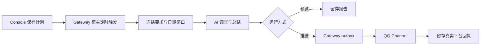

# 机器人定时任务

Console 的「机器人定时任务」用于配置 AI 调查和固定 QQ 群推送，执行由机器人 Gateway
宿主负责。关闭网页或重启 Console 不会停止调度；机器人停止期间不会执行。

## 配置与使用

1. 选择使用原生 QQ Gateway 的机器人，点击「新建定时任务」。
2. 填写名称、自然语言调查要求、机器人已加入的群号、当地时间、IANA 时区和执行星期。
   全选星期即每天。时区默认 `Asia/Shanghai`；每次执行时限默认 600 秒，可设 30–3600 秒。
3. 新任务默认暂停。先「预览运行」检查报告，确认目标和来源后启用；「立即推送」创建一次
   真实发送，和下一次自动触发分开记录。启用后按下次计划时间触发，不立即发送。
4. 选择任务查看历史，打开记录查看触发、调查与总结、群消息投递三个步骤、冻结的要求、
   日期窗口、报告及平台回执；可跳转机器人执行轨迹查看模型与检索工具过程。

模型和搜索能力复用该实例的配置。Native/LangGraph 使用已配置的公共检索工具，Codex
也可使用实例允许的原生网页搜索。未配置可用数据源、账号不明确、来源不可访问时，任务要求
AI 明确说明限制；调度器不自带 X/Twitter 全量时间线数据源，也不把网页搜索视为完整统计。

例如每天 09:00 推送 tibo 昨日推文，可以使用界面的「昨日推文示例」，把其中的账号替换为
准确的 `@用户名` 或主页链接，再填写实际群号。示例要求逐条列时间、中文要点、原文链接，
区分原创、回复、转推并去重，最后总结主要观点。只有完整时间线证据才可报告总数；否则使用
「已检索到」并注明覆盖范围。系统不猜测同名账号，不预置实际群号或自动启用示例任务。

## 调度与运行事实

参考 [CrewAI Flows](https://docs.crewai.com/en/concepts/flows) 的显式步骤、独立运行 ID 和
持久状态，使用已有 Agent 和 Channel 组成固定管线，不引入 CrewAI 依赖或通用工作流编辑器。

| 情况 | 行为 |
| --- | --- |
| 日期范围 | 每次按计划时间和任务时区固定「昨天」的当地零点至今日零点，左闭右开；夏令时日期不假设为 24 小时 |
| DST 缺失或重复时间 | 跳过不存在的当地时间；重复小时只运行第一遍 |
| 重复触发 | SQLite 事务以任务、配置版本和计划时间去重；同一手动请求 ID 也不会重复运行 |
| 停机多天 | 合并到最近一次到期时间，不逐日补发；旧的定时排队记录在重启时过期，手动请求保留 |
| 上一期仍在执行或有手动请求排队 | 本期记录为跳过；同任务不重叠。机器人串行处理定时任务；连接不可用时，旧定时排队记录合并到新一期 |
| 目标群正在执行 | 尚未执行的任务排队等待；在本次执行时限内重试进入群会话，超时保留失败原因 |
| 修改、暂停 | 版本校验避免覆盖他人的修改；旧版本排队任务取消，活动任务请求停止，已经开始投递的消息不能保证撤回 |
| 模型预算耗尽、超时或输出完整性检查失败 | 保留失败原因，不把未完成报告自动发送到群 |
| 发送失败或未知 | 区分失败与未知；不自动重发。先核对群消息，再决定是否明确创建新的推送 |
| 机器人重启 | 活动记录从原 Gateway outbox/回执恢复；已获平台确认仍记录为平台确认，其余中断不会重跑模型或重发 |
| 删除 | 活动任务需先停止；删除计划保留历史配置快照和运行记录 |

「平台已确认」表示 OneBot 已返回有效消息回执，不表示消息已展示或群成员已读。
预览成功只证明生成报告；AI 总结质量及检索完整性仍需按来源核查。

## 权限与源码边界

遵守[四层运行时](../../specs/runtime-four-layer-definition/spec.md)与
[六层依赖](../../specs/domain-layered-dependencies/spec.md)。`schedules` 中 models 管输入和端口，
repository 管私有 SQLite，service 管管理用例与流转，runtime 管宿主循环。Gateway 装配执行
适配器；Console 调用公开服务，不执行模型或直接操作 OneBot。

任务及记录位于该实例 Gateway state root 的 `schedules/schedules.sqlite3`，通过现有
`PrivateDatabase` 的私有权限、稳定锁和事务保护，不存入群成员工作区。新功能无新增环境变量。
控制台写操作只接受本机同源请求，并验证 Host；远程管理使用 SSH 隧道。开发代理保留原始
Host/Origin。私有 API 响应禁止缓存。

宿主根据已保存配置创建专用调度身份，权限固定为普通用户，群号由冻结配置绑定；不伪造
QQ 入站用户或 Owner。定时研究只允许公共搜索、网页读取及对应工具发现/结果读取，禁用
原生 shell、写文件、扩展应用、后台委托和工具自行发送。生成的最终文本由 Gateway 统一投递，
仍使用原有 session/run、取消控制、writer generation、outbox 和 provider acknowledgement。

| 端点（前缀 `/api/bots/{instance_id}`） | 方法 | 用途 |
| --- | --- | --- |
| `/schedules` | GET / POST | 任务和调度心跳 / 创建 |
| `/schedules/{task_id}` | PUT / DELETE | 带 revision 更新 / 删除 |
| `/schedules/{task_id}/runs` | POST | 带 revision、request_id 创建预览或推送，preview 默认 true |
| `/schedule-runs` | GET | 按 task_id 可选过滤，以 limit/offset 分页 |
| `/schedule-runs/{run_id}` | GET | 完整快照、正文和回执 |
| `/schedule-runs/{run_id}/cancel` | POST | 停止排队任务或请求活动任务停止 |

## 源码入口

- [调度服务](../../src/chatcopilot/schedules/service.py)、[宿主循环](../../src/chatcopilot/schedules/runtime.py)
- [Gateway 执行适配](../../src/chatcopilot/gateway/scheduled.py)、[运行协调](../../src/chatcopilot/gateway/coordinator.py)
- [Console API](../../console/backend/routes/schedules.py)、[页面](../../console/web/src/pages/SchedulesPage.tsx)
- [调度回归](../../tests/unit/test_bot_schedules.py)、[管线回归](../../tests/unit/test_gateway_schedules.py)、[API 回归](../../tests/unit/test_console_schedules.py)

验证按[开发指南](../guides/development.md)执行。使用固定模型/渠道夹具的本地管线测试和界面
实测，不能替代真实模型检索、X 时间线覆盖或实际 QQ 群发送的外部验收。
